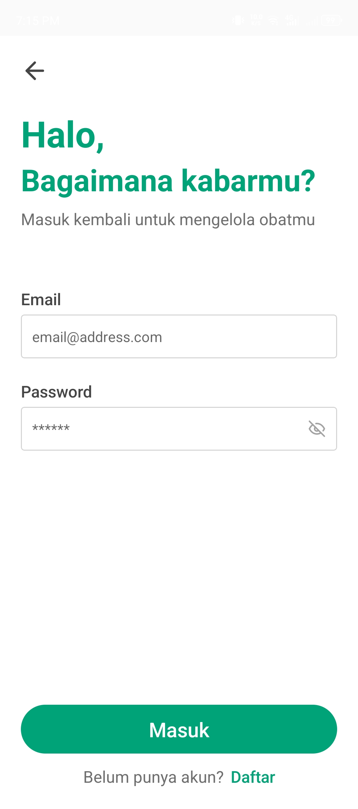

# 📱 AMOST App

**AMOST** stands for **Ayo Minum Obat Secara Teratur** (_Let's Take Medicine Regularly_).  
It is an Android application that helps individuals take their medicine according to the instructions of medical personnel or even through self-medication practices.

---

## 🚀 Features

- Medication reminders with customizable schedules.
- Store medication details such as name, dosage, frequency, duration, and stock quantity.
- Track medication adherence logs and statistics.
- Profile customization for better personalization.
- Option to export medication records (e.g., PDF format).

---

## 🛠️ Tech Stack

### 🔹 Frontend

- **Expo + React Native** → For cross-platform mobile development.
- **NativeWind (Tailwind CSS for React Native)** → To accelerate styling and ensure UI consistency across devices.

### 🔹 Backend

- **Node.js** → Lightweight and fast runtime for server-side logic.
- **Supabase** → Open-source backend-as-a-service providing:
  - Authentication
  - Database
  - File Storage
  - Auto-generated APIs

---

## 📸 Screenshots

| Splash Screen                                               | Welcome Screen                                                | Sign In                                         | Sign Up                                         |
| ----------------------------------------------------------- | ------------------------------------------------------------- | ----------------------------------------------- | ----------------------------------------------- |
|  |  |  |  |

| Home Screen                                      | My Medication                                  | Activity Screen                                      | Profile Screen                                    |
| ------------------------------------------------ | ---------------------------------------------- | ---------------------------------------------------- | ------------------------------------------------- |
|  |  |  |  |

| Medication Check                                     | Logs Screen                                 | Push Notification                                     |
| ---------------------------------------------------- | ------------------------------------------- | ----------------------------------------------------- |
|  |  |  |

|                                                          | Medication Details                                       |                                                          |
| -------------------------------------------------------- | -------------------------------------------------------- | -------------------------------------------------------- |
|  |  |  |

---

## 🎥 Demo Video

👉 [Watch the Demo Video on Google Drive](https://drive.google.com/file/d/1lwtB8ZWmr5ds7MDLFqnF4EFWFuEgpzaX/view)

---
